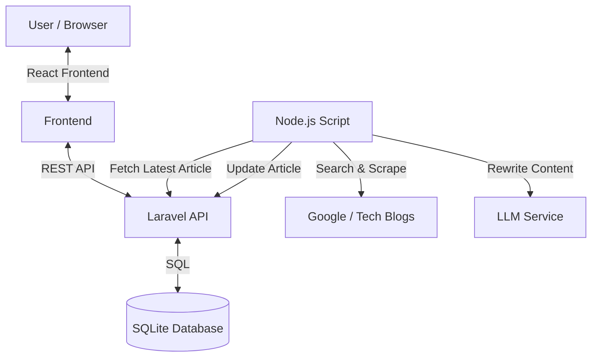

# Vibe Coded Monorepo – BeyondChats Assignment

A multi-phase article management system demonstrating scraping, AI-assisted rewriting,
and full-stack integration under realistic time constraints.

---

## 🏗️ Architecture Overview

This project follows a **minimal, reviewer-friendly stack** using only Laravel, React, and Node.js.
The goal is to demonstrate system design clarity, trade-offs, and end-to-end data flow.

### Architecture Diagram



> If the diagram does not render, the flow is:
> **React → Laravel API → SQLite**, with **Node.js** handling scraping and AI rewriting.

---

## ⚖️ Trade-offs & Key Decisions

### 1. Mocked External Services (Time Constraint)

* **Google Search:** Simulated SERP logic to avoid CAPTCHA and paid API dependencies.
* **LLM:** Rewrite logic is simulated to demonstrate architecture without token costs.
* **Impact:** All internal system interactions are real; only external providers are mocked.

### 2. HTML Rendering & Security

* **Decision:** Used `dangerouslySetInnerHTML` to render AI-generated HTML correctly.
* **Trade-off:** In production, this would require sanitization (e.g. DOMPurify).
  For this assignment, correctness of LLM output rendering was prioritized.

### 3. SQLite Database

* **Decision:** SQLite chosen for zero-configuration setup.
* **Impact:** Lower concurrency, but ideal for local evaluation and assignment scale.

### 4. Monorepo Structure

* **Decision:** Single repository containing:

  * `backend-laravel`
  * `script-node` (Node.js automation)
  * `frontend-react`
* **Benefit:** Easy navigation and holistic system understanding for reviewers.

---

## 🚀 Local Setup Instructions

### 1. Backend (Laravel)

```bash
cd backend-laravel
cp .env.example .env
composer install
php artisan migrate:fresh --seed
php artisan serve
```

### 2. Frontend (React)

```bash
cd frontend-react
npm install
npm run dev
```

### 3. Automation Script (Node.js)

```bash
cd script-node
node index.js
```

---

## 🌐 Live Demo

You can view the live frontend here: **[https://monorepo-two-rho.vercel.app/](https://monorepo-two-rho.vercel.app/)**

> Note: The frontend is deployed on Vercel. Since the backend is running locally, the live demo may show empty data or mock data depending on API connectivity. For the full experience, run the backend locally.

---

## 🚧 Known Limitations

* Scraper selectors are tuned for generic blog layouts.
* SSL verification is disabled only for local scraping experiments to avoid certificate issues.
  This would never be disabled in a production system.

---

## ✅ Assignment Coverage

* Phase 1: Blog scraping + Laravel CRUD APIs ✔
* Phase 2: Node.js pipeline + AI-assisted rewriting (simulated) ✔
* Phase 3: React frontend displaying original and updated articles ✔
