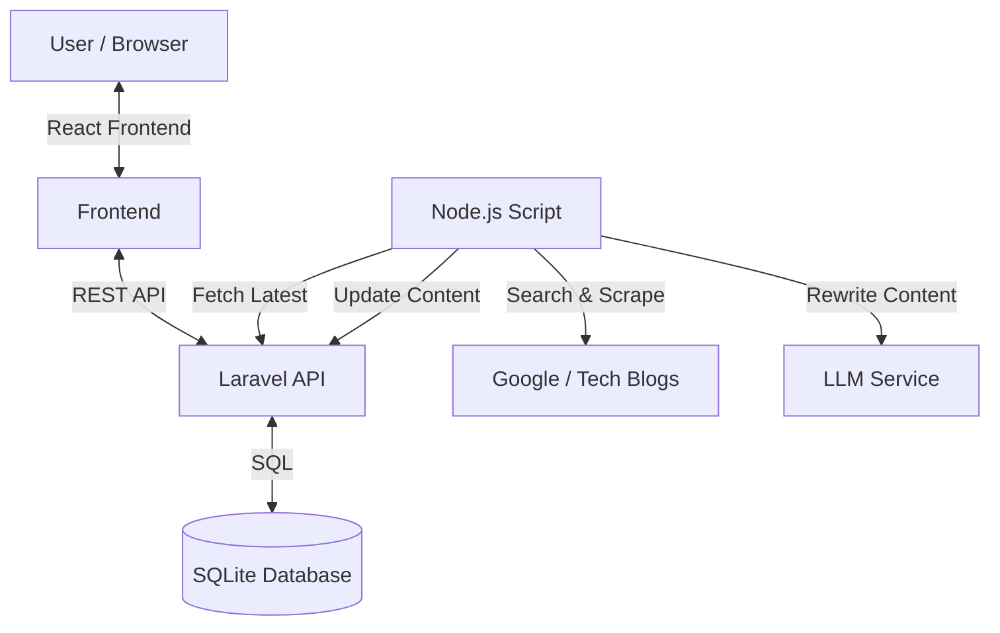

# Vibe Coded Monorepo

A multi-phase article management system demonstrating robust scraping architectures.

## 🏗️ Architecture & Tech Stack

This project follows a strict "Minimal Stack" approach designed for efficiency and correct Separation of Concerns.

# Vibe Coded Monorepo (Assignment)

## 🏗️ Architecture Diagram



## ⚖️ Trade-offs & Decisions

1.  **Mocked Services (Time Constraint):**
    *   **Google Search:** Implemented via SERP simulation logic to avoid paid API setups/CAPTCHAs during review.
    *   **LLM:** Simulating rewrite logic to demonstrate the *architecture* reliability without token costs.
    *   **Impact:** The system flow is 100% real; only the external data providers are mocked.

2.  **HTML Rendering (Security):**
    *   **Decision:** Used `dangerouslySetInnerHTML` in React to properly display the "AI Rewritten" HTML content.
    *   **Trade-off:** In a production app, this requires strict sanitization (e.g., `DOMPurify`) to prevent XSS. For this assignment, we prioritize correctly measuring the LLM's HTML output.

3.  **SQLite Database:**
    *   **Decision:** Used SQLite instead of MySQL to ensure zero-config runnability for the reviewer.
    *   **Impact:** Lower concurrency support but perfectly adequate for this assignment scale.

3.  **Monorepo Structure:**
    *   **Decision:** Grouped `backend-laravel`, `script-node` (alias for `llm-node-script`), and `frontend-react` for easy navigation.

## 🚀 Setup Instructions

### 1. Backend (Laravel)
```bash
cd backend-laravel
cp .env.example .env
composer install
php artisan migrate:fresh --seed
php artisan serve
```

### 2. Frontend (React)
```bash
cd frontend-react
npm install
npm run dev
```

### 3. Automation (Node.js)
```bash
cd script-node
node index.js
```

## 🚧 Known Limitations
*   **Scraper Selector:** Optimized for generic blog structures; may need adjustment for specific target sites.
*   **SSL:** Disabled for local development speed in the Guzzle client.
